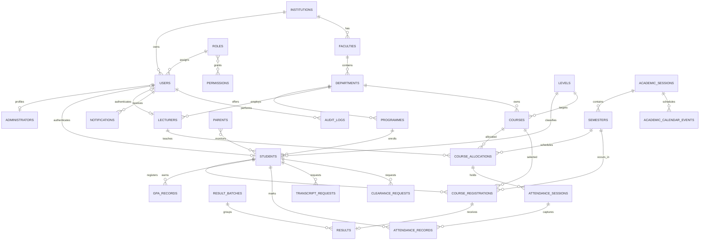

# MaryResult ER Diagram

The production schema is defined in `database/schema.sql`. The diagram below highlights the central relationships. Tenant-owned tables also carry `institution_id` even where the line is omitted for readability.

## Data Rules

- Every student matric number, course code, department code, and faculty code is unique inside an institution.
- A student can register a course only once per semester.
- A course has one result batch per semester, and a registration has one final result.
- Score and grading checks are enforced both at the API boundary and in MySQL.
- Audit records retain actor, IP address, user agent, entity, action, and JSON metadata.
- Transcript verification codes and public UUIDs avoid exposing sequential identifiers in documents.